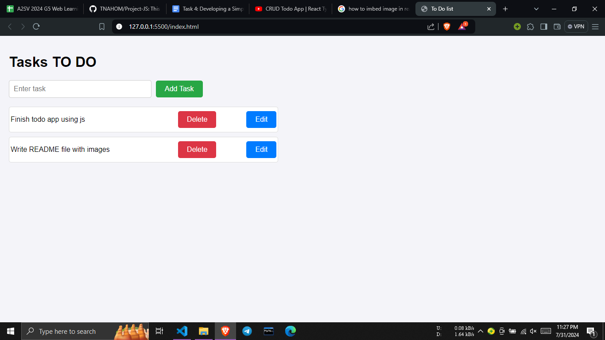
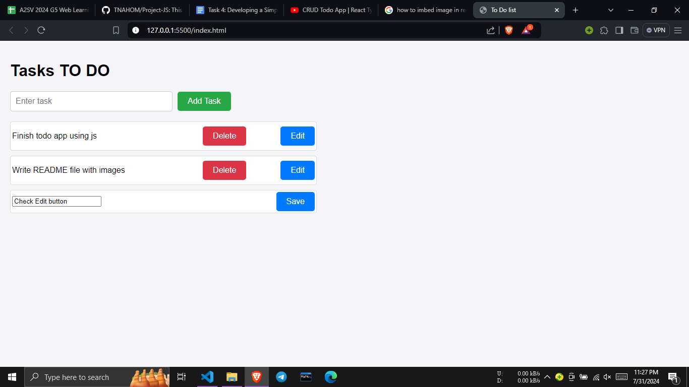

# TODO list

A simple web-based Task Manager application that allows users to add, edit, and delete tasks. Tasks are stored in the browser's local storage, ensuring they persist across page reloads.

## Features

- Add, edit, and delete tasks
- Persistent storage using local storage

### Installation

1. Clone the repository or download the source code.
2. Open `index.html` in your web browser.

### Usage

1. **Add a Task**: Enter a task and click "Add Task".
2. **Edit a Task**: Click "Edit", modify the task, and click "Save".
3. **Delete a Task**: Click "Delete" next to the task.

